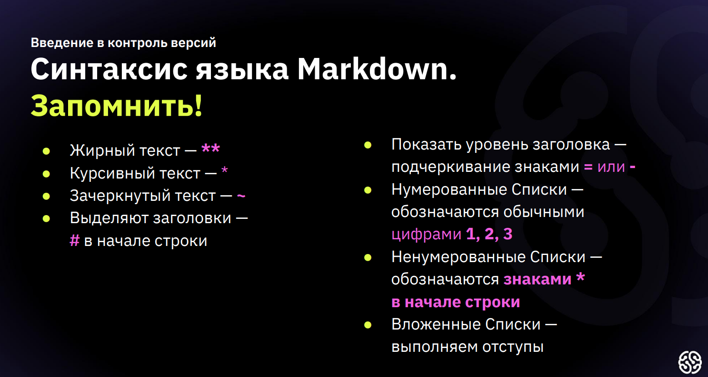

# Заголовок 1 

Заголовок 1 уровня
======================

## Заголовок 2 

Заголовок 2 уровня
----------------------
Заголовок 2 уровня
-

### Заголовок 2 
#### Заголовок 3 
#### Заголовок 4 
##### Заголовок 5 
###### Заголовок 6 

## Text
*курсив*  курсив \
**жирный**  __жирный__ \
***оба варианта***   ___оба варианта___ \
~~зачеркнутый~~ \
`code` 

```bush
git clone https://github.com/
```

```javascript
console.log(helloWorld);
```
-----------------------------------
## unordered
- макрерованый
* маркерований
    * вложеность 

## oldered list
1. list
2. list

## To-do list
- [x] Выйти на улицу
- [x] Зайти в магазин
- [ ] Купить продукты
  - [x] Молоко
  - [x] Хлеб
  - [ ] Помидоры
- [ ] Вернуться домой
---
### Table

|#  |animal|stars|
|--:|-----:|----:|
|1  |  cat |  34 | 
|2  |  dog | 554 |
|3  |mouse |  78 |

> Можно поставить двоеточие (:) рядом с дефисами для выравнивания текста:
* по левой стороне (|:----|)
* по центру (|:----:|)\
* по правой стороне (|----:|)
---
## Link
[GitHub](https://github.com/)
[GitHub](https://github.com/"подсказка")

## image



<!-- comment -->
