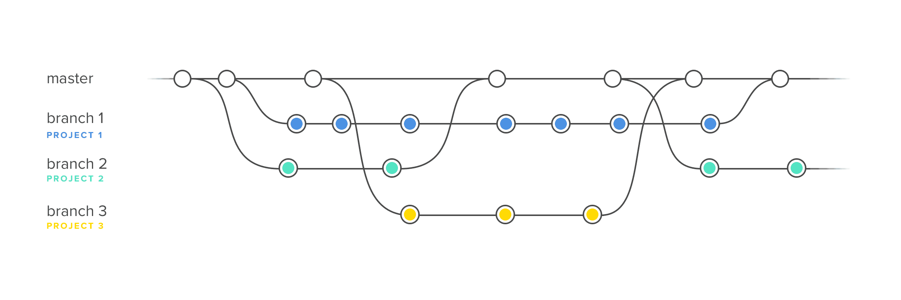

GIT#2 - система контроля версий.
=====================================
**initial commit** - first commit (recommended)\
**.gitignore** - file to ignore files |[__more__...](https://www.atlassian.com/ru/git/tutorials/saving-changes/gitignore)

## Commands:
* `git branch` - show all branches and current branch
    >**flag** | `-r` | show remote branches (remote)\
    >**flag** | `-a` | show all branches (remote and local)
* `git branch branch_name` - create a new branch
* `git branch -m branch_new_name` - rename the branch (находяcь на ветке)
    > on another branch - `git branch -m master main` (example)
* `git branch -d branch_name` - delete a branch
    >**flag** `| -D |` - forced deletion (without checking for new files)
* `git checkout main` - перейти на актуальное состояние изменений (last commit) / ветку
* `git checkout -b branch_name` - create a new branch and move to branch
* `git merge branch_name` - to merge changes new branch to parent branch
    > when use `git merge`, a new commit created
-------------------------------------------------
## Dictionary:
1. **branch** - отделение, филиал, ветвь
2. **merge** - сливаться, сливать, соединяться
3. **without** - без, вне, за
4. **accept** - принимать, признавать, соглашаться

