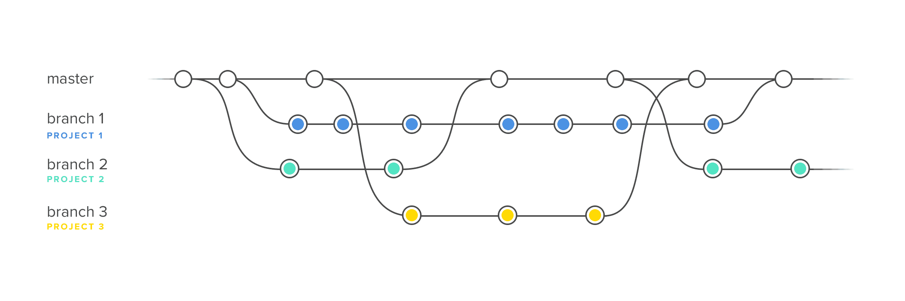

GIT#2 - система контроля версий.
=====================================
**initial commit** - first commit (recommended)\
**.gitignore** - file to ignore files

## Commands:
* `git branch` - show all branches and current branch
* `git branch branch_name` - create a new branch
* `git checkout main` - перейти на актуальное состояние изменений / ветку
* `git checkout -b branch_name` - create a new branch and move to branch
* `git merge branch_name` - to merge changes new branch to parent branch
    > when use `git merge`, a new commit created\
    > сливать находясь в родительской ветки
* `git branch -d branch_name` - delete a branch\
    **flag** `| -D |` - forced deletion (without checking for new files)
* ``
-------------------------------------------------
## Dictionary:
1. **branch** - отделение, филиал, ветвь
1. **merge** - сливаться, сливать, соединяться
1. **without** - без, вне, за
1. **accept** - принимать, признавать, соглашаться

