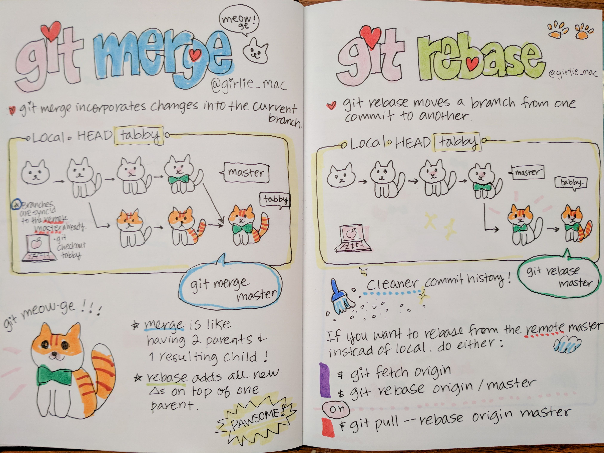

GIT_PRO
=====================================
Справочники:
[(+_+)](https://jinv.ru/github/guide-git-i-github/) & [(\*_*)](https://www.atlassian.com/ru/git/tutorials)\
`git reset` — лучше всего использовать для отмены локальных частных изменений.\
`git revert` — лучший инструмент для отмены общих публичных изменений.
## Commands:
* `git commit --amend` - overwrite the last commit _(create new **hash** commit)_
* `git checkout file_name` - recover the file/changes the file
* `git reset --hard` - delete all changes __until__ the __last commit__
    >`git reset --hard j8h3` - delete all changes __until__ the __commit__
* `git revert j8h7` - roll back commit _(create new commit)_
    > old commit stay to story log
* `git rebase` - обьеденят ветки как `merge`, но меняет историю в начало\
    >**flag** `| --abort |` - cancel rebase\
    >**flag** `| --skip |` - skip the commit\
    >**flag** `| --continue |` - continue work rebase\
**(no recommend if you’re working not alone!)** [__video on the work__](https://youtu.be/d5rvy5XPyzk) & [__video #2__](https://youtu.be/jxwPgfmutjs)
    >## difference  **rebase** _&_ **merge**:
    >
-------------------------------------------------
## Dictionary:
1. **amend** - вносить поправки, исправлять, улучшать, чинить
2. **overwrite** - переписывать, затирать
3. **recover** - восстанавливать
4. **until** - до, не раньше
5. **revert** - возвращаться, повернуть назад
6. **rebase** - перебазировать
